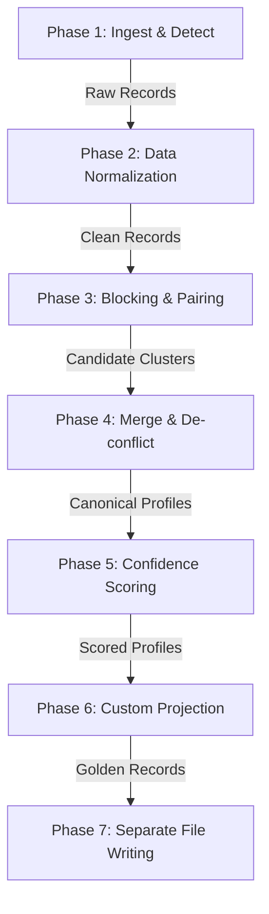

# Multi-Source Candidate Profiler & Identity Resolution Engine

An enterprise-grade Python candidate profile aggregation system. This engine ingests candidate resumes, scrapers, and datasets from heterogeneous sources, resolves candidate identity, deduplicates records, and exports clean canonical profiles according to custom schemas.

---

## 1. Quick Start

### Installation
Clone the repository and install the dependencies:
```bash
pip install -r requirements.txt
```

### Running the Web Dashboard UI
Start the interactive Flask dashboard to drag-and-drop resumes, live-edit configurations, and preview outputs:
```bash
python app.py
```
Open your browser and navigate to **`http://localhost:5000`**.

### Running the CLI
Run the batch candidate transformer from the command line:
```bash
python main.py \
  --inputs sample_data/ \
  --config config/output_config.json \
  --output output.json \
  --report report.json
```

### Running Unit Tests
Validate the system logic using the pytest suite (111 tests):
```bash
python -m pytest tests/ -v
```

---

## 2. Pipeline Architecture

The pipeline processes candidate data sequentially to safely merge profiles into clean golden records:



1.  **Ingest & Detect**: Scans input files and URLs, routing each to its matching ingestion adapter.
2.  **Data Normalization**: Standardizes messy data fields (names, phone formats, country lists, timeline dates) and matches skills against a canonical taxonomy database.
3.  **Blocking & Pairing**: Index-blocks on unique keys (Email, Phone, social URLs) to avoid O(N²) comparisons, pairing matching records.
4.  **Merge & De-conflict**: Combines clustered records into unified Canonical Profiles using a source trust hierarchy.
5.  **Confidence Scoring**: Evaluates profile trust and completeness scores between `0.0` and `1.0`.
6.  **Custom Projection**: Dynamically transforms the profiles according to custom user-defined schemas.
7.  **Separate File Writing**: Saves each candidate output profile in its own standalone JSON file in the `output/` folder.

---

## 3. System Modules & Directory Structure

*   **`src/models/`**: Defines the data models. Contains `candidate.py` (defining `Location`, `Links`, `Skill`, `Experience`, `Education`, and `CanonicalProfile`) and `provenance.py` (for database audit records).
*   **`src/adapters/`**: Pluggable ingestion adapters that parse various candidate formats into unified `RawCandidateRecord` structures.
*   **`src/normalizers/`**: Sanitization modules standardizing names, E.164 phone formats, ISO-3166 countries, YYYY-MM dates, taxonomy skills, and URLs.
*   **`src/engine/`**: Core algorithmic deduplication engines. Contains `entity_resolution.py` (blocking index & scoring), `profile_merger.py` (field union rules), `conflict_resolver.py` (trust hierarchies), and `confidence.py` (completeness grading).
*   **`src/output/`**: Serialization structures. Handles dynamic schema configuration mapping (`configurator.py`) and explainability outputs (`report.py`).
*   **`src/pipeline.py`**: The orchestrator coordinating adapter discoverability, normalization, merging, and output transformation.

---

## 4. Adapters & Supported Source Types

The system includes **7 pluggable adapters** inheriting from a unified `BaseAdapter` interface:

1.  **`ResumeJsonAdapter`** (Source: `resume_json`): Ingests pre-parsed candidate resumes in structured JSON.
2.  **`LinkedInJsonAdapter`** (Source: `linkedin_json`): Scrapes public LinkedIn profiles from direct URLs using Apify Scraper APIs, or parses offline JSON profile exports.
3.  **`GitHubAdapter`** (Source: `github`): Fetches user details, repositories, and programming language distributions from the GitHub REST API.
4.  **`ATSCsvAdapter`** (Source: `ats_csv`): Parses tabular ATS CSV files, automatically mapping headers to fields.
5.  **`ATSJsonAdapter`** (Source: `ats_json`): Parses databases candidate listing exports. Standardizes nested camelCase fields, `startDate`/`endDate` metrics, and nested social profiles.
6.  **`PDFAdapter`** (Source: `pdf`): Parses raw resume PDFs using `pdfplumber`, employing layout-grouping heuristics to extract experience timelines and academic records.
7.  **`PortfolioWebAdapter`** (Source: `portfolio_web`): Extracts profile text and skills from portfolio URLs.

---

## 5. Output Configuration Schema

The output is dynamically projected at runtime using `config/output_config.json`. This configuration supports field renames, array mappings, confidence overlays, and provenance logs:

```json
{
  "fields": [
    {"path": "candidate_id", "from": "candidate_id"},
    {"path": "full_name", "from": "full_name"},
    {"path": "emails", "from": "emails[*]"},
    {"path": "phones", "from": "phones[*]"},
    {"path": "location.city", "from": "location.city"},
    {"path": "location.region", "from": "location.region"},
    {"path": "location.country", "from": "location.country"},
    {"path": "links.linkedin", "from": "links.linkedin"},
    {"path": "links.github", "from": "links.github"},
    {"path": "links.portfolio", "from": "links.portfolio"},
    {"path": "links.other", "from": "links.other[*]"},
    {"path": "headline", "from": "headline"},
    {"path": "years_experience", "from": "years_experience"},
    {"path": "skills", "from": "skills[*]"},
    {"path": "experience", "from": "experience[*]"},
    {"path": "education", "from": "education[*]"}
  ],
  "include_confidence": true,
  "include_provenance": true,
  "on_missing": "null"
}
```

---

## 6. Normalization Rules

*   **Names**: Removes honorifics (Mr., Dr., Prof., etc.), strips punctuation/dashes, and converts to Title Case. Similarity scoring uses token set comparison, yielding a `1.0` match for reversed word orders (e.g. `"Dahagam Srivallabha"` vs `"Srivallabha Dahagam"`).
*   **Phone Numbers**: Strips symbols and applies standardized E.164 country prefixes (using Google's `libphonenumber`).
*   **Country Codes**: Maps variations (e.g., `USA`, `United States`, `US`) to ISO-3166 Alpha-2 codes (e.g., `US`).
*   **Dates**: Formats start/end dates (e.g., `"March 2022"`, `"03/22"`, `"Present"`) to standardized `YYYY-MM` or `"present"`.
*   **Skills**: Normalizes skills using `skill_taxonomy.json` alias trees (e.g., mapping `"Core Java"`, `"JDK"`, `"Java SE"` to canonical `"Java"`).
*   **URLs**: Strips query strings, trailing slashes, and maps inputs to canonical `linkedin.com/in/...` or `github.com/...` structures.

---

## 7. Conflict Resolution & Merging Policies

*   **Match Threshold**: Record pairs are compared if they collide on a unique key (email, phone, linkedin, github). They are matched if their similarity score exceeds `80`. Merging is blocked on weak signals (name alone) to prevent false positives.
*   **Trust Hierarchy Resolution**: When multiple sources provide conflicting values for a scalar field, the value from the highest-ranked source is kept:
    $$\text{resume\_json} > \text{linkedin\_json} > \text{github} > \text{ats\_json} > \text{ats\_csv} > \text{hr\_system} > \text{portfolio\_web} > \text{pdf}$$
*   **List Unioning**: Experience, education, and skills arrays are aggregated, deduplicated, and sorted.
*   **Provenance Tracking**: Every merge decision is logged, recording the winning value, superseded value, source type, and extraction methodology.

---

## 8. Handled Edge Cases

1.  **Reversed Name Tokens**: Identifies set equivalence for reversed names like `"Srivallabha Dahagam"` and `"Dahagam Srivallabha"`.
2.  **Unicode Dash Mappings**: Converts Unicode en-dashes (`–`), em-dashes (`—`), and replacement characters (``) to standard hyphens `-` for date parsing.
3.  **Score & GPA Stripping**: Cleans GPA markings (e.g., `"GPA: 9.00 / 10.0"`, `"10/10"`, `"Aggregate: 98.9 / 100%"`) from PDF academic records to extract pure disciplines (like `"Computer Science and Engineering"` or `"MPC"`).
4.  **Error scraper handling**: Discards failed (404) or private LinkedIn scraping responses, preventing empty `"unknown"` profiles from corrupting candidate lists.
5.  **Duplicate fields mapping**: Maps sub-keys within education and experience arrays (`startDate`/`endDate` $\rightarrow$ `start`/`end`, `graduationYear` $\rightarrow$ `end_year`) and keeps provenance records readable.

---

## 9. Explainability & Provenance Reports

The system provides fully auditable and explainable candidate profile reconciliation, detailing exactly why records were merged and how conflicts were resolved.

### Key Explainability Features
*   **Merge Explanations**: Details every matched record pair, their overall similarity score, and the specific matching keys or signals (such as matching emails, phone numbers, GitHub profiles, or LinkedIn URLs) that triggered the merge, complete with signal weights.
*   **Confidence Breakdowns**: Provides a field-by-field trust and completeness evaluation, highlighting how individual fields contribute to the overall profile confidence score.
*   **Source Contributions**: Tracks which source documents contributed to which fields, mapping inputs back to the originating files.
*   **Granular Field Provenance**: Maintains a chronological audit trail for every single field, recording the winning value, originating source type, extraction method, and source-specific confidence metrics.

### Generating Reports
*   **Per-Candidate Reports (Automatic)**: Every time the pipeline processes data (via the CLI or Web UI), a candidate-specific explainability report is written directly to the output directory as `<candidate_name>_report.json` next to the candidate's canonical profile `<candidate_name>.json`. If `--report-text` is specified in the CLI, a text version is also generated as `<candidate_name>_report.txt`.
*   **CLI JSON Report**: Use the `--report <path.json>` option to export a structured machine-readable JSON log of all merge telemetry.
*   **CLI Text Report**: Use the `--report-text <path.txt>` option to generate a formatted, human-readable text file suitable for quick audits.
*   **Web Dashboard UI**: The flask app includes a dedicated **Explainability Report** tab to visualize real-time pipeline telemetry, logs, and matching explanation objects interactively.
