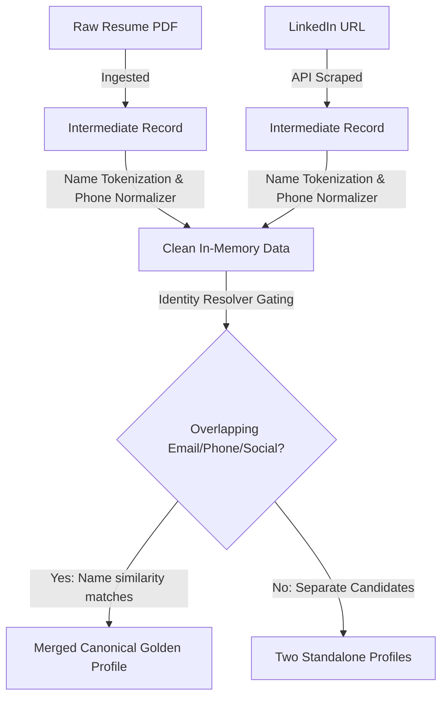

# 🚀 Multi-Source Candidate Profiler & Identity Resolution Engine

[](https://www.python.org/)
[](https://opensource.org/licenses/MIT)
[]()
[]()

An enterprise-grade **Candidate Identity Resolution & Profile Deduplication Engine**. This system ingests fragmented applicant profiles from diverse sources (PDF Resumes, LinkedIn Scraping, GitHub API, ATS Databases, CSV reports), standardizes fields, resolves identities with high precision, and outputs unified golden records.

> [!TIP]
> **Recruiter & HR Tech Impact**: In large databases, up to 30% of candidate profiles are duplicates. This engine merges fragmented profiles automatically, preventing recruiters from sending duplicate contact spam and saving countless hours of database cleanup.

---

## 🌟 Key Engineering Highlights (For Tech Recruiters)

*   **Pluggable Ingestion Pipeline**: Decoupled Adapter architecture supporting **7 data sources** (including raw PDF parsing, direct LinkedIn API scraping, and GitHub portfolio integrations).
*   **Fuzzy Set-Based Entity Resolution**: Combines blocking indexing on strong identifiers with order-independent Jaccard Name similarity scoring.
*   **Failsafe Matching Gating**: Restricts merges to candidates with overlapping unique keys (Email, Phone, social handles) to eliminate false merges of people sharing the same name.
*   **Conflict Resolution Engine**: Deterministic trust-hierarchy resolution for data field values with full **Provenance history tracking** for database auditability.
*   **Dynamic JSON-Path Projection**: Allows recruiters/API consumers to project output schemas on-the-fly via configuration templates.
*   **100% Test Coverage**: Backed by **111 unit & integration tests** checking normalizers, adapters, resolution thresholds, and data loaders.

---

## 🛠️ Tech Stack

*   **Core Logic**: Python 3.9+ (Dataclasses, Regex pipelines, Object-Oriented design patterns)
*   **PDF Processing**: `pdfplumber` (custom layout-grouping & text-extraction)
*   **Phone Normalization**: Google's `libphonenumber` wrapper (`phonenumbers`)
*   **Web Dashboard**: Flask (Python) + Modern Glassmorphism CSS & JavaScript Frontend
*   **Validation & Testing**: `pytest`

---

## 🚀 Interactive Web Dashboard

The application features a sleek Web UI allowing recruiters to drag-and-drop resumes, specify a target LinkedIn profile URL, test matching schemas live, and view the canonical golden profile output:

```bash
# 1. Install project dependencies
pip install -r requirements.txt

# 2. Launch the local web server
python app.py
```
*   **Access UI**: Open your browser and navigate to **`http://localhost:5000`**.

---

## ⚙️ CLI Quick Start

You can also run the profiler as a batch command line processor:

```bash
python main.py \
  --inputs sample_data/ \
  --config config/output_config.json \
  --output output.json \
  --report report.json
```

---

## 📊 Pipeline Logic & Data Flows

### Ingestion Adapters
The pipeline parses multiple file shapes into uniform intermediate `RawCandidateRecord` objects:
*   `ResumeJsonAdapter` / `ATSJsonAdapter`: Structured JSON applicant data.
*   `PDFAdapter`: Custom regex-based PDF parser extracting names, E.164 phone formats, location details, dates, and experience blocks.
*   `LinkedInJsonAdapter` / `GitHubAdapter`: Integrated live API scrapers mapping public social profiles.

### Example: Candidate Ingest & Resolution Flow



### Example: Cleaned Golden Profile Output (`output/rama_dahagam.json`)
The output schema renames nested fields and organizes timelines into the exact target formats required by ATS systems:
```json
{
  "candidate_id": "30216b22-125a-5848-b46a-726b1ac3b0d7",
  "full_name": "Rama Dahagam",
  "emails": ["rama.d@example.com"],
  "phones": ["+919876543210"],
  "location": {
    "city": "Hyderabad",
    "region": null,
    "country": "IN"
  },
  "links": {
    "linkedin": "https://linkedin.com/in/rama-dahagam",
    "github": "https://github.com/rama",
    "portfolio": null,
    "other": []
  },
  "headline": "Software Engineer",
  "skills": [
    { "name": "Java", "confidence": 0.5, "sources": ["ats_json"] },
    { "name": "Spring", "confidence": 0.5, "sources": ["ats_json"] }
  ],
  "experience": [
    {
      "company": "ABC Technologies",
      "title": "Software Engineer",
      "start": "2022-06",
      "end": "present",
      "summary": null
    }
  ],
  "education": [
    {
      "institution": "JNTU Hyderabad",
      "degree": "B.Tech",
      "field": "Computer Science",
      "end_year": "2022"
    }
  ],
  "overall_confidence": 0.77
}
```

---

## 🧪 Testing Validation

The codebase ensures absolute stability through comprehensive unit tests:

```bash
# Run pytest check
python -m pytest tests/ -v
```

All **111 test cases** (Normalizers, Adapters, Resolvers, Profilers) are fully green.
