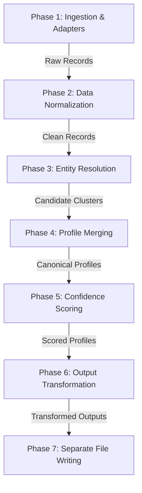

# Multi-Source Candidate Profiler & Deduplicator: Pipeline Logic & Steps

This document explains the internal logic, algorithms, and sequential pipeline execution steps used to ingest, normalize, deduplicate, merge, and export candidate data.

---

## 1. High-Level Architectural Flow

The pipeline executes in 7 sequential phases:

---

## 2. Ingestion & Adapters (Phase 1)

**Goal**: Ingest different formats (JSON, CSV, PDF, URLs) and transform them into a unified, standard schema in-memory.

*   **Standard Interface (`BaseAdapter`)**: Every adapter extends `BaseAdapter` and implements:
    *   `can_handle(source_path)`: Scans the filename, extension, or scheme to see if it matches.
    *   `ingest(source_path)`: Reads the file/URL and returns a list of `RawCandidateRecord` objects.
*   **Adapters Implemented**:
    *   **`ResumeJsonAdapter`**: Reads JSON resumes generated by parsers.
    *   **`LinkedInJsonAdapter`**: Reads scraped LinkedIn profiles (integrates with Apify's API).
    *   **`GitHubAdapter`**: Scrapes repositories, languages, and profiles from the GitHub REST API.
    *   **`ATSCsvAdapter`**: Parses tabular CSV candidate reports, automatically mapping headers to fields.
    *   **`ATSJsonAdapter`**: Parses structured JSON exports containing candidate profiles.
    *   **`HRSystemAdapter`**: Reads internal corporate employee databases.
    *   **`PDFAdapter` / `PortfolioWebAdapter`**: Uses keyword extraction to scan plain text files or portfolios.

---

## 3. Data Normalization (Phase 2)

**Goal**: Standardize messy inputs so that fields match during comparisons.

*   **Name Normalizer**: Sanitizes whitespace, converts characters to Title Case, handles initials (e.g. `K. Sharma` or `R Sharma`), and contains a similarity calculation that yields a `1.0` match for reversed name orders (e.g., `Nikhil Kalluri` vs `Kalluri Nikhil`).
*   **Phone Normalizer**: Uses regular expressions and rules to clean dashes, parenthesized area codes, and spaces. Converts numbers to standard formatting based on default country codes.
*   **Date Normalizer**: Standardizes experience/education start and end dates (e.g., `March 2022`, `03/22`, `2022-03`, `current`, `present`) into unified `YYYY-MM` or `"present"` formats to correctly calculate experience length.
*   **Country Normalizer**: Matches country strings (e.g., `USA`, `United States of America`, `US`) against ISO-3166 lists to save standard Alpha-2 codes (e.g. `US`, `IN`).
*   **Skill Normalizer**: Maps raw skill strings against a taxonomy loaded from `skill_taxonomy.json` containing aliases (e.g. mapping `Core Java`, `Java SE`, and `JDK` to the canonical skill `Java`).

---

## 4. Entity Resolution & Deduplication (Phase 3)

**Goal**: Identify which candidate records represent the same human being.

*   **Blocking (Deduplication Index)**: 
    *   To avoid $O(N^2)$ candidate pairs comparisons, we index records using **Strong Identifiers** (`email`, `phone`, `linkedin`, `github`).
    *   Only records that share at least one strong identifier are grouped as candidate pairs to be scored.
*   **Scoring Model**: Candidate pairs are scored based on field overlaps:
    *   `email_match`: +100 (Strong Signal)
    *   `phone_match`: +90 (Strong Signal)
    *   `linkedin_match` / `github_match`: +85 (Strong Signal)
    *   `name_similarity`: Up to +30 (Weak Signal)
    *   `location_match`: +10 (Weak Signal)
    *   `company_overlap`: +20 (Weak Signal)
    *   `education_overlap`: +15 (Weak Signal)
*   **Match Decision Safeguards**:
    *   **Threshold**: Set to `80` by default.
    *   **Strong Signal Constraint**: `require_strong_signal_for_merge` enforces that candidates **never merge on weak signals alone** (e.g., matching location and name). They must share at least one matching email, phone number, or social media link to prevent false merges.
*   **Transitive Closure**: Groups candidate matches into cohesive clusters (e.g. if A matches B, and B matches C, then A, B, and C form one cluster).

---

## 5. Profile Merging & Conflict Resolution (Phase 4)

**Goal**: Combine multiple candidate records in a cluster into a single Canonical Profile.

*   **List Aggregation**: List fields (like `emails`, `phones`, `skills`, `education`, `experience`) are combined, removing exact duplicates.
*   **Scalar Field Conflicts (Trust Hierarchy)**: If different records suggest conflicting values for a scalar field (e.g., one record says location is "New York" and another says "London"), the **Conflict Resolver** picks the value based on a trust hierarchy:
    $$\text{resume\_json} > \text{linkedin\_json} > \text{github} > \text{ats\_json} > \text{ats\_csv} > \text{hr\_system} > \text{portfolio\_web} > \text{pdf}$$
*   **Provenance Audits**: The system records the provenance history for every merged profile, detailing why a specific field value was selected and which source contributed it.

---

## 6. Confidence Scoring Engine (Phase 5)

**Goal**: Compute a trust score ($0.0$ to $1.0$) representing the completeness and quality of the merged profile.

*   **Field Completeness**: Checks if key fields are present.
*   **Source Quality**: Weighted based on the accuracy of the contributing sources (e.g. `resume_json` is weighted 0.95, while `pdf_keyword` is weighted 0.50).
*   **Overall Profile Confidence**: Calculated as:
    $$\text{Overall Score} = \sum (\text{Field Weight} \times \text{Field Score}) \times \text{Overall Completeness Penalty}$$

---

## 7. Output Transformation & File Saving (Phases 6 & 7)

*   **JSON-Path Configurator**: Transforms the canonical candidate schema according to the user-supplied `output_config.json` rules (e.g., renaming `full_name` to `name`, selecting specific arrays, and selecting whether to include confidence/provenance indicators).
*   **Candidate Separation Loop**: Saves each transformed candidate profile in its own standalone JSON file named after the candidate (e.g. `output/rahul_sharma.json`) inside the `output/` directory rather than writing a single aggregated list.
